# Arbres de décision — API Midzo

Ce document décrit **ce qui est implémenté** dans `app/api/**` et le **flux de décision** de chaque route (méthode, validation, auth, réponse).

> **Stack** : Next.js 15 App Router → `route.ts` → `src/models/*` → Prisma → PostgreSQL  
> **Préfixe** : toutes les routes sont sous `/api/...`  
> **CORS** : `OPTIONS` + en-têtes `Access-Control-Allow-Origin: *` sur la plupart des routes

---

## 1. Arbre global (quel chemin appeler ?)

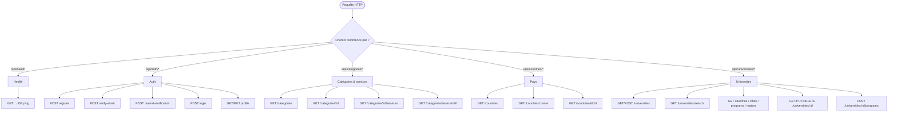

---

## 2. Légende

| Symbole | Signification |
|--------|----------------|
| ✅ | Implémenté (route handler existant) |
| 🔓 | Public (pas de JWT) |
| 🔐 | JWT requis (`Authorization: Bearer <token>`) |
| ❌ | Non implémenté (modèle Prisma seulement ou absent) |

**Format de réponse habituel**

- Succès auth / universités : `{ success: true, ... }`
- Succès catégories / pays : `{ success: true, categories \| country \| services, ... }`
- Erreur : `{ success: false, error: "..." }` ou `{ error: "..." }` selon la route
- Health : `{ status, timestamp, database }`

---

## 3. Inventaire complet (implémenté vs non)

| Domaine | Route | Méthode | Auth | Statut | Modèle / fichier |
|---------|-------|---------|------|--------|------------------|
| Santé | `/api/health` | GET | 🔓 | ✅ | `lib/prisma` |
| Auth | `/api/auth/register` | POST | 🔓 | ✅ | `UserModel`, `lib/email` |
| Auth | `/api/auth/verify-email` | POST | 🔓 | ✅ | `UserModel`, `lib/auth` |
| Auth | `/api/auth/resend-verification` | POST | 🔓 | ✅ | `UserModel`, `lib/email` |
| Auth | `/api/auth/login` | POST | 🔓 | ✅ | `UserModel`, `lib/auth` |
| Auth | `/api/auth/profile` | GET, PUT | 🔐 | ✅ | `authenticateRequest`, `UserModel` |
| Catégories | `/api/categories` | GET | 🔓 | ✅ | `CategoryModel` |
| Catégories | `/api/categories/:id` | GET | 🔓 | ✅ | `CategoryModel` |
| Catégories | `/api/categories/:id/services` | GET | 🔓 | ✅ | `CategoryModel` |
| Catégories | `/api/categories/services/all` | GET | 🔓 | ✅ | `CategoryModel` |
| Pays | `/api/countries` | GET | 🔓 | ✅ | `CountryModel` |
| Pays | `/api/countries/:name` | GET | 🔓 | ✅ | `CountryModel` (détails + relations) |
| Pays | `/api/countries/id/:id` | GET | 🔓 | ✅ | `CountryModel` (sans relations) |
| Universités | `/api/universities` | GET, POST | 🔓 | ✅ | `UniversityModel` |
| Universités | `/api/universities/search` | GET | 🔓 | ✅ | `UniversityModel` + pagination mémoire |
| Universités | `/api/universities/:id` | GET, PUT, DELETE | 🔓 | ✅ | `UniversityModel` |
| Universités | `/api/universities/:id/programs` | POST | 🔓 | ✅ | `UniversityModel.addProgram` |
| Universités | `/api/universities/countries` | GET | 🔓 | ✅ | `UniversityModel.getCountries` |
| Universités | `/api/universities/cities/:country` | GET | 🔓 | ✅ | `UniversityModel.getCitiesByCountry` |
| Universités | `/api/universities/programs` | GET | 🔓 | ✅ | `UniversityModel.getPrograms` |
| Universités | `/api/universities/regions` | GET | 🔓 | ✅ | Liste statique `["Europe"]` |
| **Réservations** | `/api/bookings` ou similaire | — | — | ❌ | `UserBooking` en schéma, pas de route |
| **Actualités** | `/api/news` ou similaire | — | — | ❌ | `News` en schéma, pas de route |
| Catégories | CRUD POST/PUT/DELETE | — | — | ❌ | Lecture seule |
| Pays | CRUD POST/PUT/DELETE | — | — | ❌ | Lecture seule |

Toutes les routes listées ✅ exposent aussi **`OPTIONS`** pour le preflight CORS.

---

## 4. Auth — arbres de décision

### 4.1 `POST /api/auth/register`

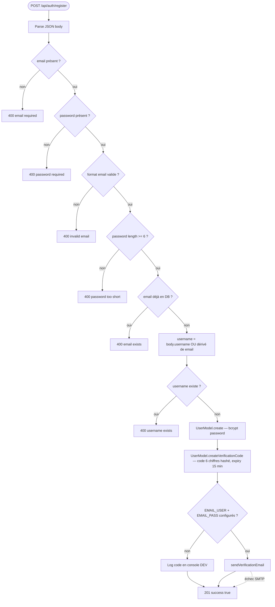

**Implémenté** : inscription + envoi code (ou log dev). **Pas de JWT** à l’inscription.

---

### 4.2 `POST /api/auth/verify-email`

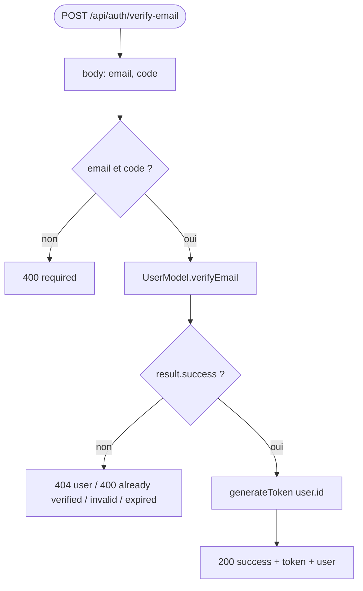

---

### 4.3 `POST /api/auth/resend-verification`

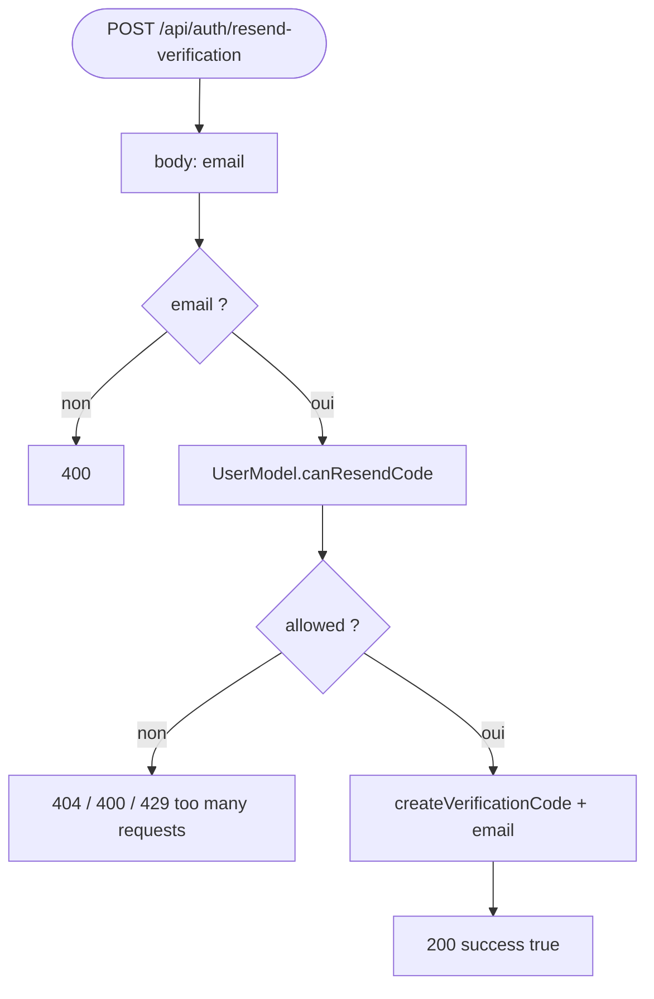

Délai minimum entre deux envois : **60 secondes**.

---

### 4.4 `POST /api/auth/login`

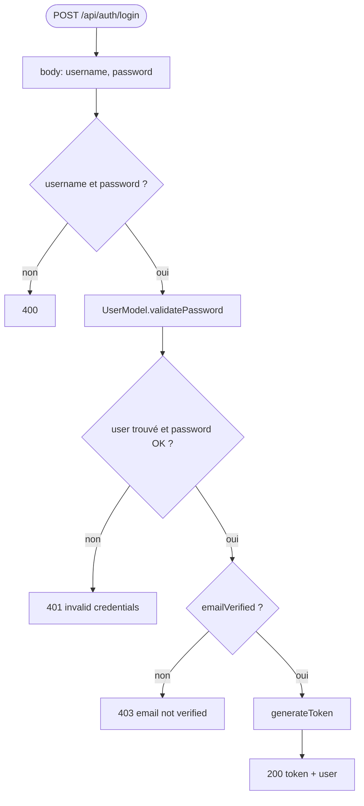

---

### 4.5 `GET` / `PUT /api/auth/profile`

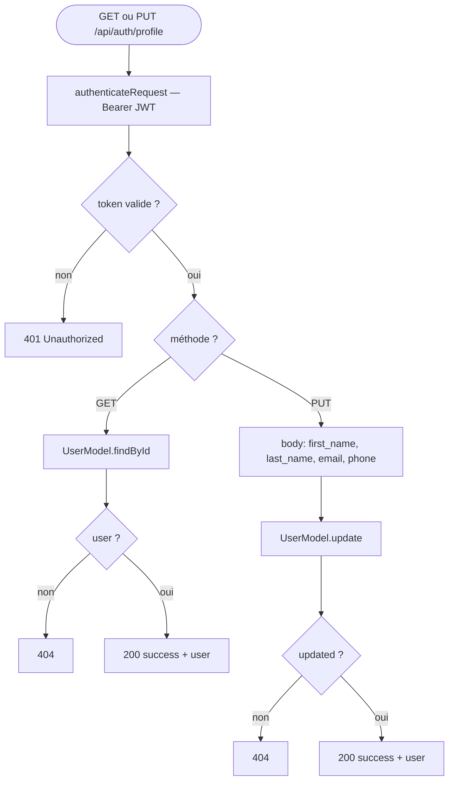

---

## 5. Catégories & services — lecture seule

### 5.1 `GET /api/categories`

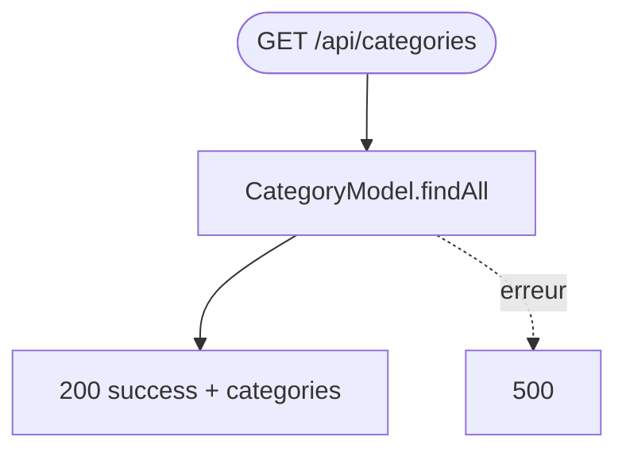

### 5.2 `GET /api/categories/:id`

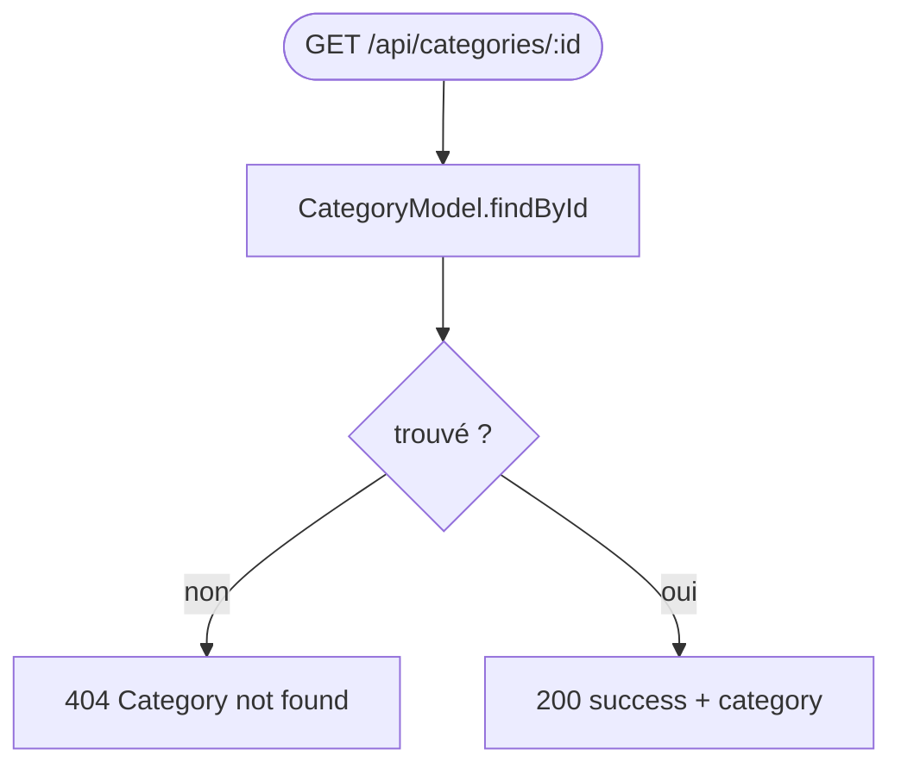

### 5.3 `GET /api/categories/:id/services`

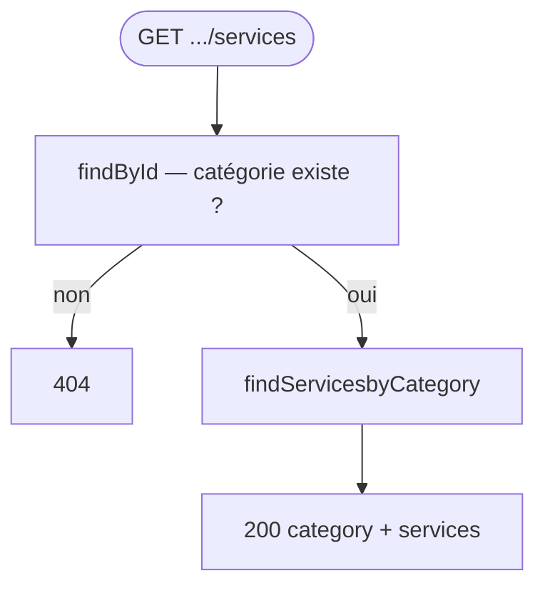

### 5.4 `GET /api/categories/services/all`

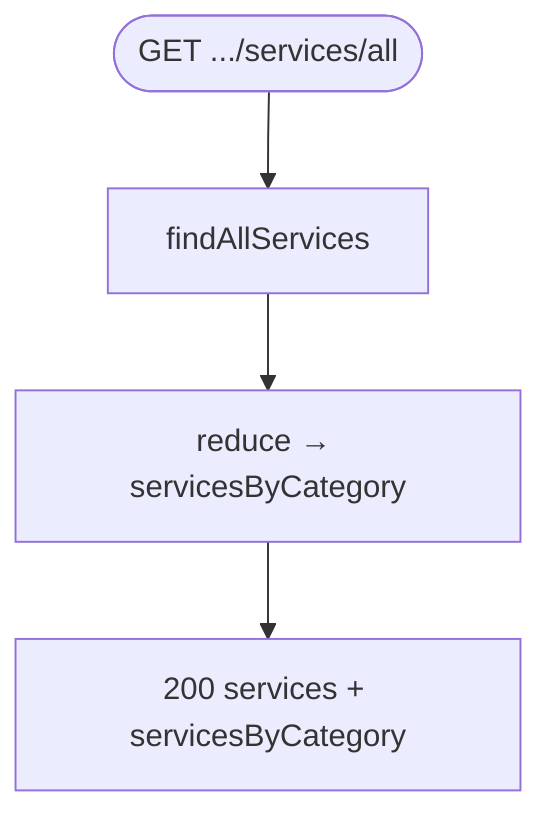

**IDs catégories connus (seed)** : `study`, `professional`, `tourism`, `business`.

---

## 6. Pays — lecture seule

### 6.1 `GET /api/countries`

Liste tous les pays (sans sous-détails).

### 6.2 `GET /api/countries/:name`

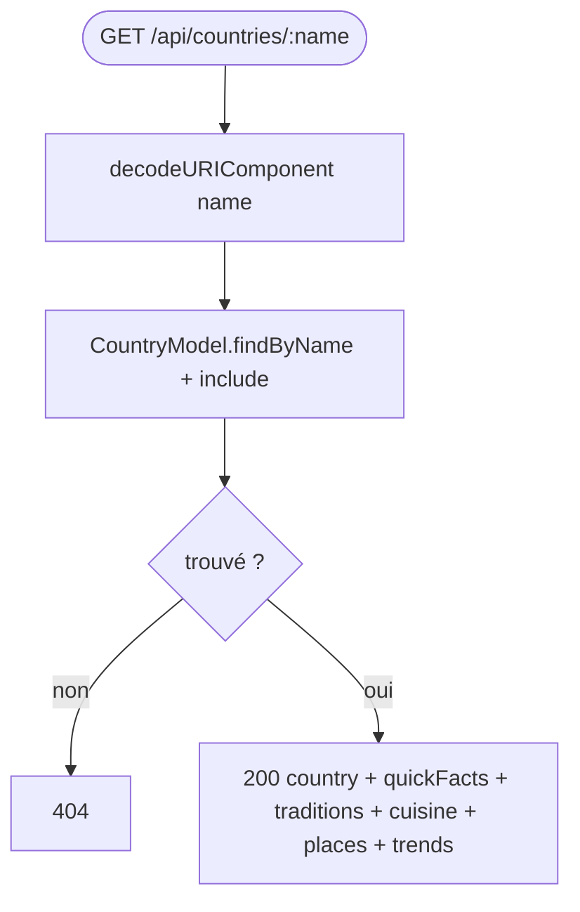

### 6.3 `GET /api/countries/id/:id`

Même chose mais **par ID numérique**, **sans** les relations incluses (`findById` seulement).

---

## 7. Universités — CRUD partiel + filtres

### 7.1 `GET /api/universities`

**Query params** (tous optionnels) :

| Param | Map vers filtre |
|-------|-----------------|
| `country` | `filters.country` (contains) |
| `region` | `filters.region` → liste pays Europe si pas de `country` |
| `city` | `filters.city` (contains) |
| `program` | `filters.programName` |
| `level` | `filters.programLevel` (equals) |
| `search` | nom ou specialty (contains) |

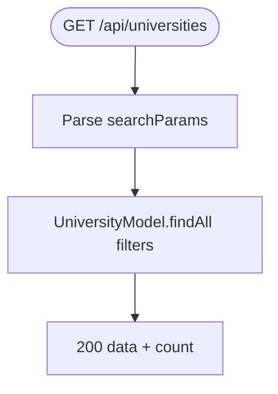

### 7.2 `GET /api/universities/search`

Identique aux filtres de `GET /universities`, puis **pagination en mémoire** :

- `limit` (défaut 50), `offset` (défaut 0)
- Réponse : `data`, `pagination.total`, `hasMore`

### 7.3 `POST /api/universities`

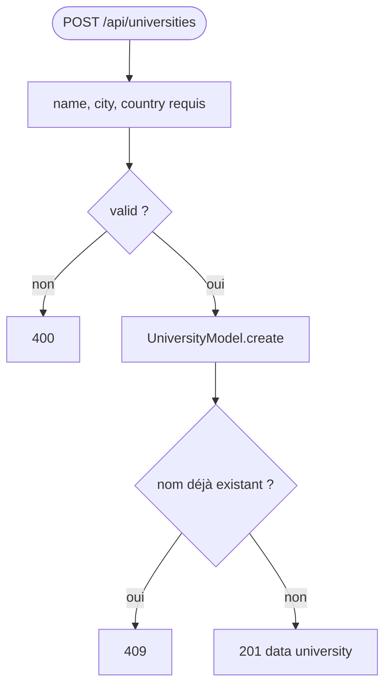

### 7.4 `GET / PUT / DELETE /api/universities/:id`

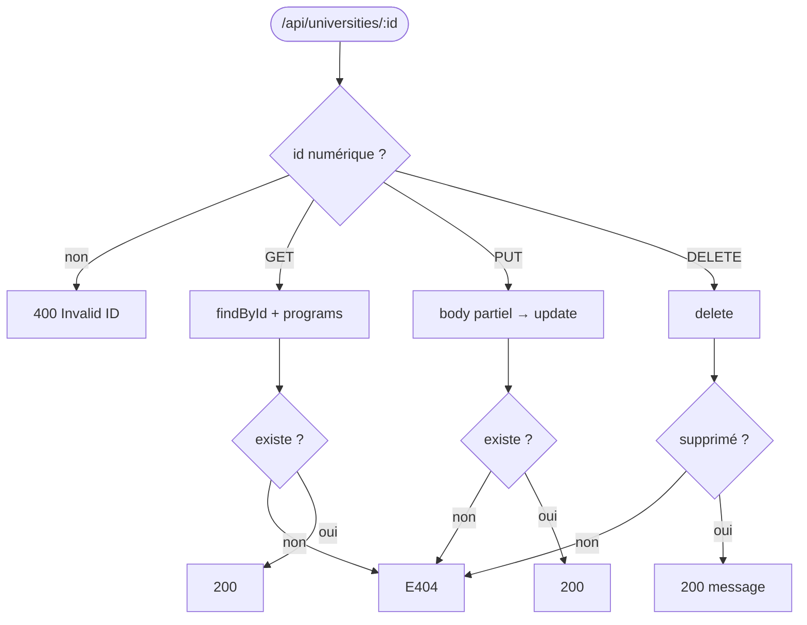

### 7.5 `POST /api/universities/:id/programs`

Body : `name`, `level` (ex. `Bachelor`, `Master`) → `UniversityModel.addProgram`. Conflit unique → **409**.

### 7.6 Routes utilitaires universités

| Route | Comportement |
|-------|----------------|
| `GET /universities/countries` | Liste distincte des `country` en DB |
| `GET /universities/cities/:country` | Villes pour un pays (equals) |
| `GET /universities/programs` | Programmes distincts + regroupement `grouped` |
| `GET /universities/regions` | **Statique** : `["Europe"]` |

**Région `europe` dans `UniversityModel`** : France, Germany, Netherlands, Italy, Belgium, Luxembourg, Estonia.

---

## 8. Santé

### `GET /api/health`

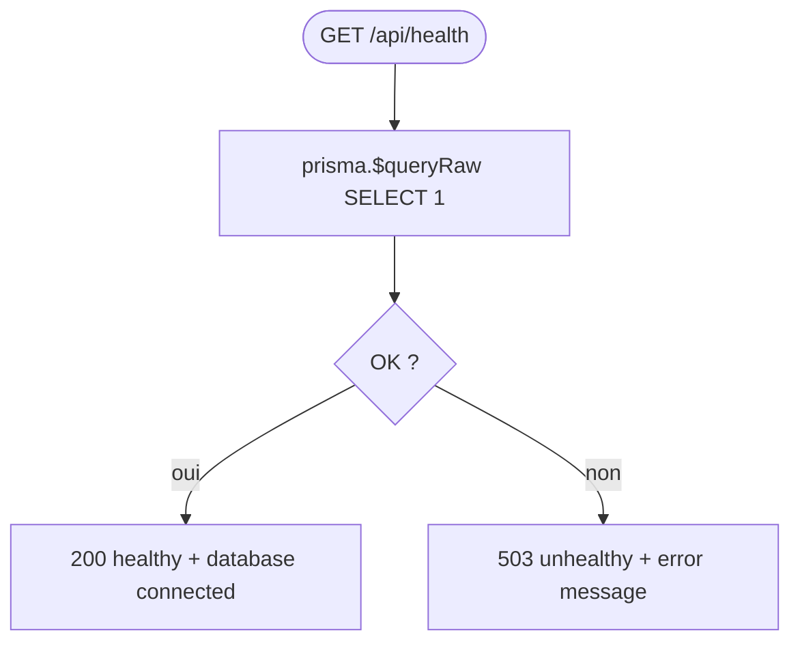

---

## 9. Flux utilisateur typique (frontend)

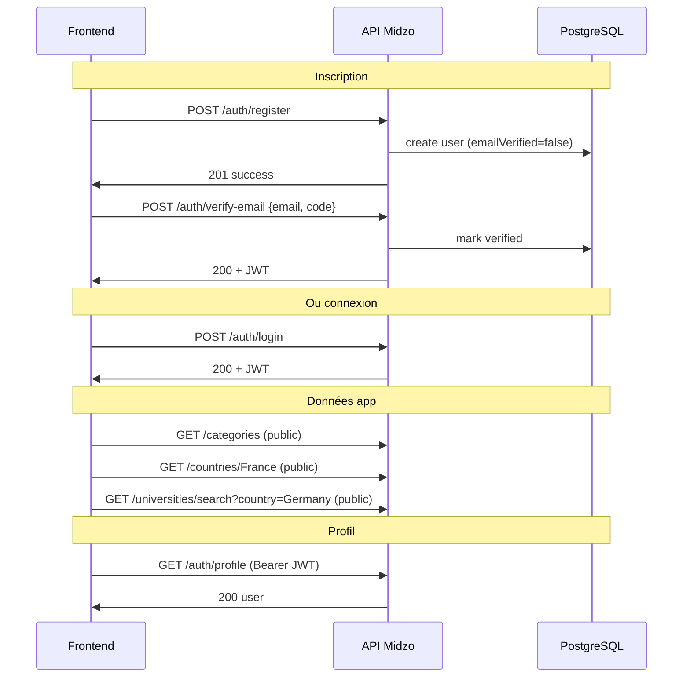

---

## 10. Modèles Prisma sans API (candidats features)

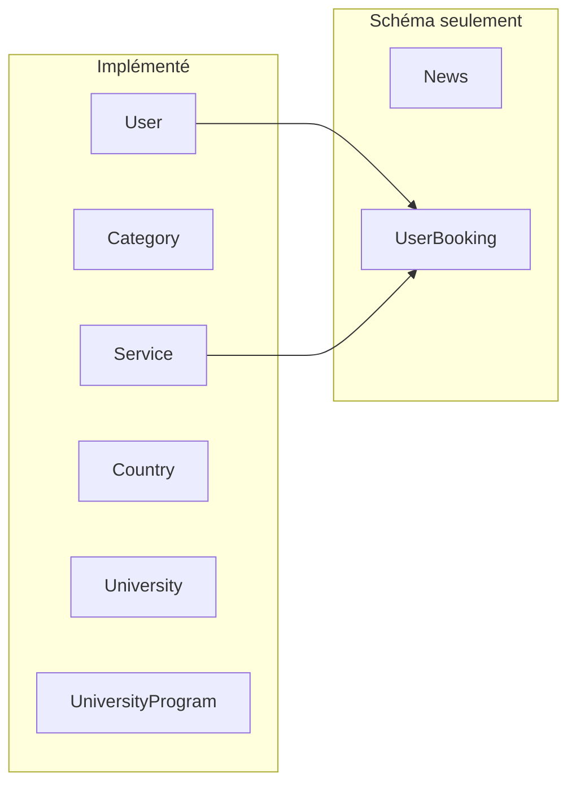

Pour ajouter une feature sur `UserBooking` ou `News`, le chemin standard sera :

1. `prisma/schema.prisma` (si changement schéma)
2. `src/models/Booking.ts` ou `News.ts`
3. `app/api/bookings/route.ts` (etc.)
4. Protéger avec `authenticateRequest` si données utilisateur

---

## 11. Fichiers source par route

| Route | Fichier handler |
|-------|-----------------|
| `/api/health` | `app/api/health/route.ts` |
| `/api/auth/*` | `app/api/auth/*/route.ts` |
| `/api/categories/*` | `app/api/categories/**/route.ts` |
| `/api/countries/*` | `app/api/countries/**/route.ts` |
| `/api/universities/*` | `app/api/universities/**/route.ts` |

**Couche métier** : `src/models/User.ts`, `Category.ts`, `Country.ts`, `University.ts`  
**Infra** : `lib/prisma.ts`, `lib/auth.ts`, `lib/email.ts`  
**Middleware** : `middleware.ts` (OPTIONS sur `/api/:path*`)

---

*Dernière mise à jour : aligné sur le code du dépôt `midzobackend`.*
